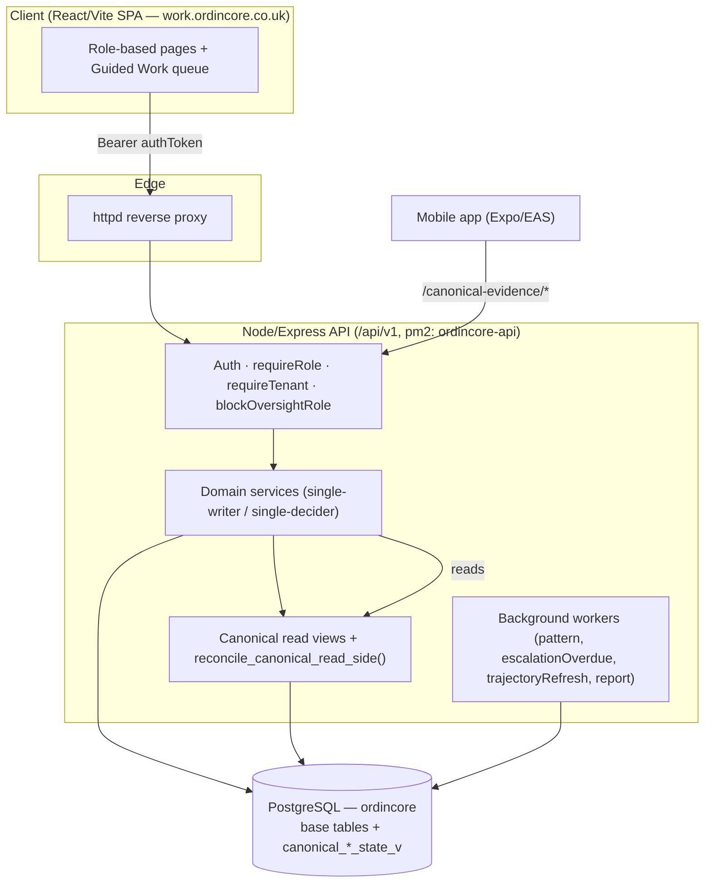
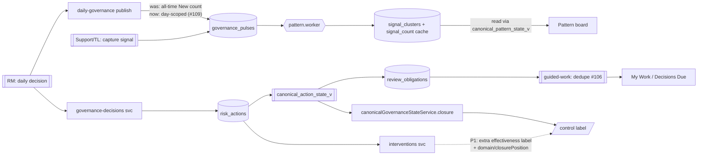
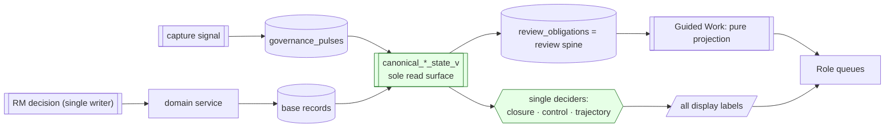
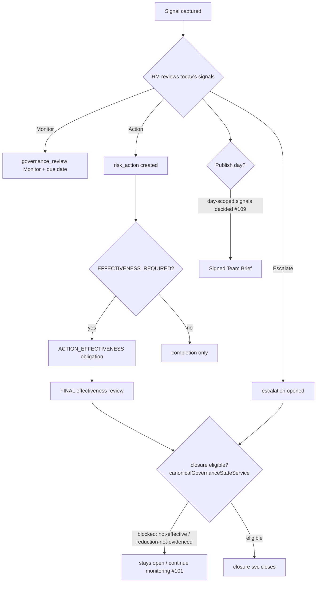
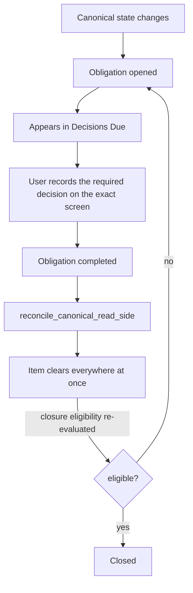
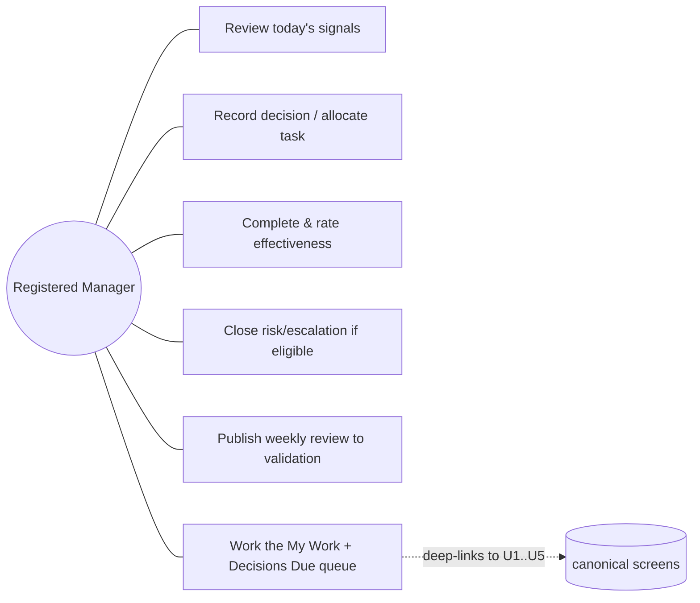
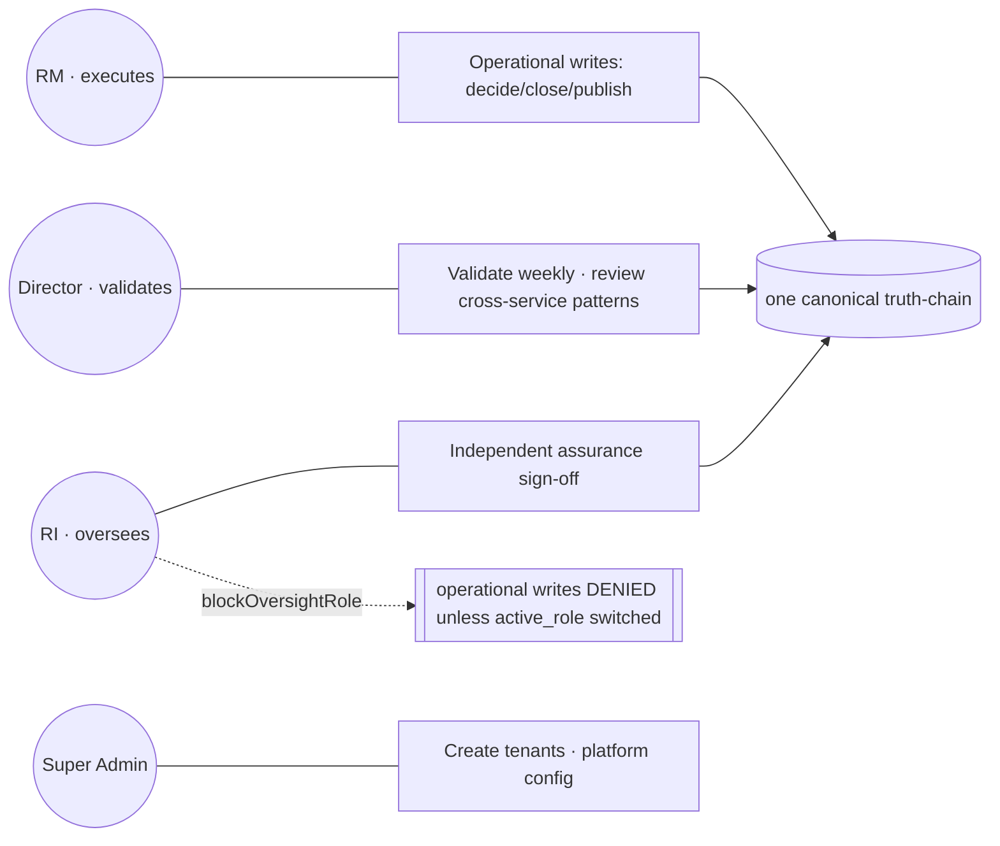
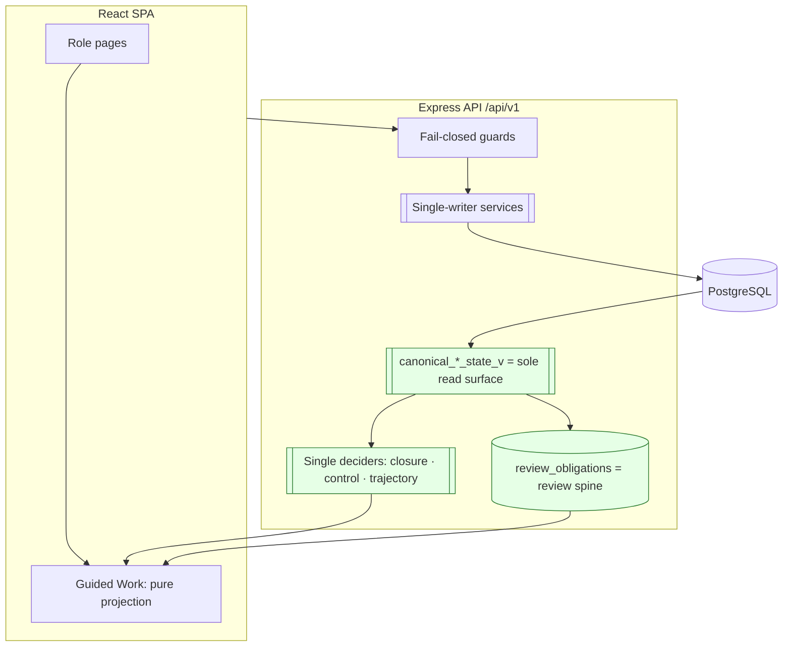

# OrdinCore — System Blueprint

**Purpose:** a single, clear picture of how the whole system works today — every frontend page, what it links to, which API it calls, and the functionality it delivers — set against the governance **doctrine**, with an explicit doctrine-vs-implementation comparison and the diagrams (2 DFDs, 2 flowcharts, 2 use-cases, 2 architectures) contrasting the two.

**Audience:** engineers, reviewers and governance stakeholders who need to reason about the system as a whole.
**Build basis:** `main` (post-#109). Cross-references: [Truth-Chain Dependency Map](./TRUTH_CHAIN_DEPENDENCY_MAP.md), [Canonical Violation Register](./CANONICAL_VIOLATION_REGISTER.md), [Role Permission Matrix](./ROLE_PERMISSION_MATRIX.md), [Multi-Tenant Isolation Audit](./MULTI_TENANT_ISOLATION_AUDIT.md).

---

## 0. The doctrine in one page

OrdinCore is a **multi-tenant care-governance** platform. Its governing idea is a **single canonical truth-chain** per governance object:

> **write owner → base DB record → canonical read view (`canonical_*_state_v`) → review obligations → events → every consumer (web, mobile, Guided Work, reports).**

Five non-negotiable rules (the "doctrine"):

1. **Single writer.** Only one service may write each object's lifecycle: `canonicalGovernanceAction.service` (risk actions), `escalations.service` (escalations), `risks.service` (risks), governance pulse ingestion (signals).
2. **Single decider.** Only `canonicalGovernanceStateService` decides **closure eligibility**; only `canonicalControlPosition.service` decides **control position**; only `trajectoryForRisk()` computes **trajectory**.
3. **Read through the canonical view, never the base table's free-text status.** Consumers read `is_open`/`is_active`/`closure_eligible`/`requires_effectiveness_review` flags, not string literals.
4. **Obligations are the review spine.** Work becomes "due" because a `canonical_review_obligation_state_v` row is actionable — not because a heuristic guessed it. Completion clears the obligation.
5. **Guided Work only reads.** It projects and prioritises canonical state and deep-links to the real screen. It never completes, closes, or decides.

Everything below is measured against these five rules.

---

## 1. System context



**Tenancy:** every non-SUPER_ADMIN caller is pinned to their token's `company_id` (`requireTenant`); SUPER_ADMIN has `company_id = NULL` and is intentionally cross-tenant. House-scoped roles (Team Leader, Support Worker) are further narrowed to `user_houses`.

---

## 2. Frontend page map — links, endpoints, functionality, doctrine posture

Base API path = `/api/v1`. Auth = `Authorization: Bearer <localStorage.authToken>` on every call (single client rule; the #105 bug was components reading the wrong key). Routes are from [App.tsx](../../frontend/src/app/App.tsx); nav from `RoleBasedNavigation`.

### 2.1 Entry / identity
| Page (route) | Links to next | Primary endpoint(s) | Functionality | Doctrine posture |
|---|---|---|---|---|
| Login `/`, `/login` | → `/dashboard` (role landing) | `POST /auth/login`, `POST /auth/refresh` | Authenticate, store `authToken` + `user` | ✅ only unauthenticated routes are login/refresh/forgot/reset |
| Forgotten / Reset password | → `/login` | `POST /auth/forgot-password`, `POST /auth/reset-password` | Self-service recovery | ✅ |
| Profile `/profile` | — | `GET/PATCH /users/:id` | View/update own profile, switch `active_role` | ✅ `active_role` switch is how an RI drops oversight to act |

### 2.2 The work surface (all roles)
| Page (route) | Links to next | Primary endpoint(s) | Functionality | Doctrine posture |
|---|---|---|---|---|
| **My Work / Guided Work** `/my-work` | Deep-links to the exact canonical screen per item (`/effectiveness?focus=`, `/risk-register/:id?review=1`, `/governance-dashboard?pulseId=`, `/weekly-review/:id`, `/escalation-log?focus=`) | `GET /guided-work` | Two sections: **My Work** (personally-assigned actions) and **Decisions Due** (obligation-backed role decisions). Dedupes each concern to one row (#106); signals scoped to today+overdue (#109) | ✅ **read-only projection**; single strongest doctrine holder |
| Dashboard `/dashboard` | → role home | `GET /governance-state`, `GET /analytics/*` | Role landing / KPIs | ✅ reads canonical state |

### 2.3 RM operational governance (write authority)
| Page (route) | Links to next | Primary endpoint(s) | Functionality | Doctrine posture |
|---|---|---|---|---|
| Governance Dashboard `/governance-dashboard` (was Oversight Board) | → signal review, → escalate, → weekly | `GET /daily-governance`, `POST /governance-decisions`, `POST /daily-governance/:log/publish` | RM Daily Oversight: review each signal, record decision (Monitor/Escalate/Action/No-action), publish signed Team Brief | ✅ publish gate now day-scoped (#109); decisions are the single write path |
| Governance Pulse `/governance-pulse`, `/governance-pulse/:id`, `/pulse-history` | → signal detail | `GET/POST /pulses` | Capture signals (all roles) | ✅ ingestion is the signal write owner |
| Signals `/signals`, `/signals/:id` | → decision | `GET /pulses/:id`, `GET /clusters` | Inspect signal + its cluster membership | ✅ reads `canonical_signal_evidence_v` |
| My Actions `/my-actions` | → effectiveness | `GET /actions`, `POST /actions/:id/complete` | Complete assigned actions with evidence | ✅ completion via canonical action service |
| Effectiveness `/effectiveness` | → risk detail | `GET/POST /effectiveness` | FINAL effectiveness review on EFFECTIVENESS_REQUIRED actions; clears `ACTION_EFFECTIVENESS` obligation | ✅ append-only reviews; #100 fixed the `$7` param bug |
| Weekly Review `/weekly-review`, `/weekly-review/:id` | → validation (Director) | `GET/POST /weekly-reviews`, `POST /weekly-reviews/:id/finalise`, `.../validate`, `.../publish`, `.../acknowledge` | RM authors weekly governance; finalise gate requires RM narrative/lessons/brief/concerns/anticipated-risks; Director validates; TL acknowledges | ✅ obligation + separation-of-duties (`blockOversightRole`) |
| Service Review Rollup `/service-review-rollup` | → RI sign-off | `GET /weekly-reviews/awaiting-validation`, `GET /ri-governance/*` | Provider-wide weekly position; RI assurance sign-off | ✅ gated on all sites finalised |

### 2.4 Risk & escalation lifecycle
| Page (route) | Links to next | Primary endpoint(s) | Functionality | Doctrine posture |
|---|---|---|---|---|
| Risk Register `/risk-register`, `/risk-register/:id` | → close / monitor / effectiveness | `GET /risks`, `GET /canonical-evidence/risks/:id`, `POST /governance-reviews`, `POST /closure` | View risks; RM risk-review (`?review=1`); Continue-monitoring verdict (#101); closure gated by canonical eligibility | ✅ closure decided **only** by `canonicalGovernanceStateService` |
| Risk Promotion `/risks/promote` | → risk detail | `POST /risks` (+ categories) | Promote a pattern/cluster to a registered risk | ✅ needs seeded `risk_categories` (fixed by #107/#108 template+category seeding) |
| Escalation Log `/escalation-log` | → close escalation | `GET /escalations`, `POST /closure` | Review/close open escalations; riskless closure supported (RC2) | ✅ `escalations.service` is write owner; date guard (#96) |
| Interventions `/interventions` | → risk detail | `GET /interventions` | Control/intervention view + "ready to close" hint | ⚠️ **P1-1/P1-2** — layers an extra `effectiveness==='Effective'` label + `domain/closurePosition` on top of canonical closure (see §4) |

### 2.5 Patterns, trends, oversight
| Page (route) | Links to next | Primary endpoint(s) | Functionality | Doctrine posture |
|---|---|---|---|---|
| Systemic Patterns `/systemic-patterns` | → promoted risk or pattern review | `GET /rm/patterns?includePromoted=1` | Cross-service pattern board (`data.across`); #85/#102/#103 fixes | ✅ reads `canonical_pattern_state_v`/`canonical_pattern_formation_v` |
| RM5 / Patterns `/rm5` (`/patterns` → redirect) | → pattern detail | `GET /rm/patterns`, `GET /rm/counts` | RM pattern pipeline + ribbon counts (qualifying_count ≥ 2) | ✅ canonical formation view (#95/#97) |
| Trends `/trends` | — | `GET /analytics/*` | Trajectory/heatmap trends | ✅ reads canonical trajectory (PRESENTATION roll-up) |
| Strategic / Director oversight (`/dashboard` Director) | → validate, → pattern, → risk | `GET /director-governance/*`, `GET /director/*` | Cross-service patterns, strategic risks, weekly validation | ✅ obligation-scoped after #103 |
| RI governance `/ri-governance/houses/:id/evidence-pack` | — | `GET /ri-governance/*`, `GET /ri/*` | Independent assurance reads + provider sign-off | ✅ `blockOversightRole` prevents operational writes |
| Reports `/reports`, `/monthly-report`, `/reports-classic` | — | `GET /reports`, `GET /frozen-reports/*` | Frozen, defensible PDF reports resolved from source at runtime | ✅ frozen-report provenance doctrine |
| Incidents `/incidents`, `/incidents/:id`, `/incidents/:id/timeline`, `/incidents/:id/report`, `/reconstruction` | → timeline / report | `GET /incidents`, `GET /incident-reconstructions`, `GET /reconstruction` | Incident capture, reconstruction timeline, incident report | ✅ |

### 2.6 Admin, org, platform
| Page (route) | Links to next | Primary endpoint(s) | Functionality | Doctrine posture |
|---|---|---|---|---|
| Admin dashboard `/admin`, `/admin-dashboard`, `/admin-*` | → users/houses/pulses/risks/settings | `GET /admin/*`, `GET /company-admin/*` | Company admin: users, houses, service-users, security policy, access reviews | ✅ `requireRole(ADMIN)` fail-closed; #105 fixed token-key reads |
| Org structure `/org-structure`, `/organisation-admin` | — | `GET /org-structure/*` | Org chart / structure | ✅ |
| Governance config `/governance-config`, `/governance-config/immediate-rules` | — | `GET/PUT /governance-config/*` | Thresholds, immediate-escalation rules, SLAs | ✅ platform/company config tier |
| Service users `/service-users`, `/admin/service-users` | — | `GET /service-users` | People receiving care (house-scoped; no `company_id` column — tenant derived via `house_id`) | ✅ see service_users house-scoping note |
| Super Admin `/super-admin`, `/super-admin/companies|users|settings` | → create org / admin | `GET/POST /companies`, `GET /users`, `GET /system/*` | Platform operator: create organisations (seeds risk categories + governance template — #107/#108), manage tenants | ✅ cross-tenant by design; create-org seeds now fixed |
| Billing (paused) `/admin-settings` billing tab | — | `GET /billing/*` | Stripe plumbing (activation paused pending keys) | ⏸ deferred |
| Help `/help`, `/help-admin`, Screen Assist | — | `GET /help`, `POST /screen-assist` | Guidance + in-app assist | ✅ |

---

## 3. Backend API surface (mounted resources)

All under `/api/v1` ([app.ts](../../backend/src/app.ts)). Each maps to a route file + service; the **write/decider owner** is what the doctrine pins.

| Mount | Owner concern | Single-writer / decider |
|---|---|---|
| `/auth`, `/contact` | identity, public contact | — (public, rate-limited) |
| `/guided-work`, `/my-work` | work projection | **read-only** (no writes) |
| `/daily-governance`, `/governance-decisions`, `/governance`, `/pulses` | RM daily governance + signals | pulse ingestion (signals); decisions service |
| `/actions`, `/effectiveness` | risk actions + effectiveness | `canonicalGovernanceAction.service` **only** |
| `/risks`, `/closure`, `/governance-reviews` | risk lifecycle + closure | `risks.service` (write); `canonicalGovernanceStateService` (closure decider) |
| `/escalations` | escalation lifecycle | `escalations.service` (`lifecycle_status`) |
| `/clusters`, `/rm` (rm5), `/thresholds` | patterns / formation | `pattern.worker` + promotion |
| `/weekly-reviews` | weekly governance | weekly review service + obligations |
| `/director-governance`, `/director`, `/ri-governance`, `/ri` | leadership oversight | reads canonical; RI writes blocked |
| `/reports`, `/frozen-reports`, `/exports`, `/analytics` | reporting | `reportsData.service` / `report.worker` |
| `/incidents`, `/incident-reconstructions`, `/reconstruction` | incidents | incident services |
| `/companies`, `/users`, `/houses`, `/service-users`, `/admin`, `/company-admin`, `/org-structure` | tenancy + admin | admin services |
| `/governance-config`, `/governance-state`, `/canonical-evidence`, `/governance-workflow` | config + canonical read | `reconcile_canonical_read_side()` |
| `/billing` | subscriptions | Stripe (paused) |
| `/notifications`, `/notes`, `/documents`, `/uploads`, `/help`, `/screen-assist`, `/roles`, `/system`, `/interventions` | supporting | respective services |

---

## 4. Doctrine vs current implementation — the gap

From the [Violation Register](./CANONICAL_VIOLATION_REGISTER.md) (Phase-3 consolidation applied) plus recent fixes.

| Area | Doctrine says | Current implementation | Status |
|---|---|---|---|
| **Write authority** | one writer per object | `risk_actions` inserted only by `canonicalGovernanceAction.service`; escalations/risks/pulses each single-writer | ✅ **0 P0** — write layer intact |
| **Closure decider** | only `canonicalGovernanceStateService` | risks.service & interventions.service both call it… | ✅ delegated |
| **Control/closure display** | derive label from `canonicalControlPosition.service` | `interventions.service` adds an extra `effectiveness==='Effective'` gate + `domain/closurePosition` → *two* places answer "is this controlled?" | ⚠️ **P1-1/P1-2** open (display-only; cannot contradict the AND-gated eligibility) |
| **Reads via canonical flag** | `is_open`/`is_active` etc., never literals | consolidation replaced literal predicates in dailyGovernance, weeklyReviews, reportsData, workers | ✅ P2-1/2 fixed; P2-3 reclassified legit |
| **Signal counts** | reconcile to canonical evidence IDs | `signal_clusters.signal_count` is a write-owned cache; now read from `canonical_pattern_state_v` | ✅ P2-4 fixed; I5 backfilled (mig 154) |
| **Obligations clear work** | completion clears the obligation | obligation spine drives Guided Work; role-derived heuristics were the churn source | ✅ + #106 dedupe / #109 day-scope hardened this |
| **Guided Work read-only** | never writes/decides | no INSERT/UPDATE/DELETE in guidedWork.service | ✅ doctrine held |
| **Daily governance is per-day** | a day's sign-off requires that day's signals | gate previously counted **all-time** New signals (future-dated generator flooded it) | ✅ **fixed #109** (this is the newest doctrine correction) |
| **Data invariants** | I1–I6 hold | I1–I4, I6 = 0 violations; I5 legacy residue remediated | ✅ verified live |

**Headline:** the single-writer/single-decider guarantees hold; every remaining gap is **read-side/derivation-side** (P1 display calculators in interventions), not an authority breach.

---

## 5. Diagrams

### 5.1 DFD — CURRENT implementation


### 5.2 DFD — DOCTRINE (target)

**Difference:** doctrine has **one** derivation node feeding *all* labels; current still has `interventions.service` producing a parallel control/closure hint (P1-1/2).

### 5.3 Flowchart — CURRENT daily-governance → closure


### 5.4 Flowchart — DOCTRINE closure spine

**Difference:** doctrine makes *every* item obligation-backed and self-clearing; the current flow still carries a few role-derived list entries that the #106/#103 work converged toward this model.

### 5.5 Use-case — CURRENT (RM day)


### 5.6 Use-case — DOCTRINE (separation of duties)

**Difference:** doctrine enforces that oversight roles (RI) **cannot** perform operational writes; the implementation enforces this via `blockOversightRole` and `active_role` switching.

### 5.7 Architecture — CURRENT
```mermaid
graph TB
  subgraph FE[React SPA]
    RB[RoleBasedNavigation] --> PAGES[~45 route pages]
    PAGES --> GWUI[My Work / Decisions Due]
  end
  subgraph BE["Express API /api/v1"]
    GUARDS[requireAuth · requireRole · requireTenant · blockOversightRole]
    SERVICES[~40 route→service modules]
    CANONV[canonical_*_state_v + reconcile()]
    INTP{{interventions: parallel control/closure hint · P1}}
    WORKERS[pattern · escalationOverdue · trajectoryRefresh · report]
  end
  DB[(PostgreSQL ordincore)]
  FE -->|Bearer authToken| GUARDS --> SERVICES --> DB
  SERVICES --> CANONV --> DB
  INTP -.-> SERVICES
  WORKERS --> DB
```

### 5.8 Architecture — DOCTRINE (target)

**Difference:** the doctrine architecture removes the parallel `interventions` derivation, making `canonical_*_state_v` + the three deciders the **only** source of every displayed judgement.

---

## 6. How to keep this true (guardrails)
- **New read?** consume a `canonical_*_state_v` flag, never a status literal.
- **New "is it done/closed/controlled" label?** call the existing decider; do not add a calculator (the open P1 items are the cautionary example).
- **New "due" item?** back it with a `review_obligation` so completion clears it (the #106/#109 lesson).
- **New date-sensitive gate?** scope it to the relevant day/period, never all-time (the #109 lesson — a generator can seed future-dated rows).
- **Verify:** `npm run verify:invariants` (I1–I6) and the guided-work contract tests before deploy.
